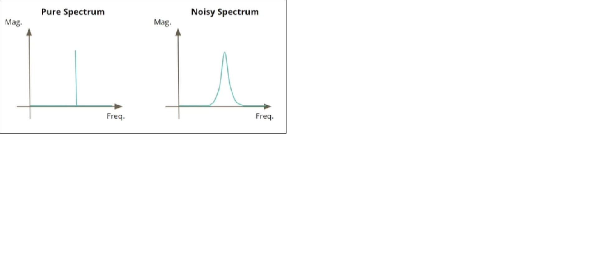

# pll_from_circuit_to_layout

# Table of contents

- [Overview](#Overview)
- [DAY 1: PLL theory and Lab overview](#Day1)
  -  [Introduction to PLL](#PLL)
  -  [PLL Components](#PLLComponents)
  
  
## Overview

The repository completely deals with Phase locked Loops from design stage to tapeout stage using the open source tools (i.e **ngspice** for circuit level and transcient anslysis, **magic** for layout design and parasitic extraction and **Caravel** which is a **standard SOC** with on chip resources to control read/write operations,supply voltages to **user dedicated space**(where we can place our PLL)) 

## Day1
The Day1 is completly about the design and working priciple of PLL and about tools which we are using to design the PLL

## PLL
- A pll is basically a control system which maintains its output signal in phase with input reference signal which is 
coming from an external source(quartz crystal).
- The main idea of this workshop is to design a PLL for clock signal where the output signal should not have any 
phase and frequency distortions with respect to reference signal

