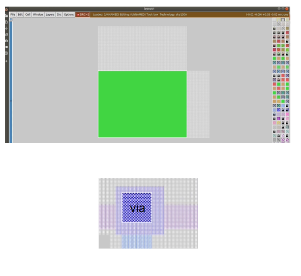

# A two day work shop on designing the phase locked loop using sky130nm - techology

# Table of contents

- [Overview](#Overview)
- [DAY 1: PLL theory and Lab overview](#Day1)
  -  [Introduction to PLL](#PLL)
  -  [PLL Components](#PLLComponents)
  -  [circuit level functional block diagrams](#circuit_level_functional_blocks_of_PLL)
  -  [charge pump responses](#charge_pump_responses)
  -  [phase_frequency_detectors](#Phase_Frequency_Detectors)
  -  [Voltage controlled Oscillator](#Voltage_Controlled_Oscillator)
  -  [Important Definations Related To PLL:](#Important_Definations_Related_To_PLL)
  -  [Tool Setup](#Tool_Setup)
  -  [Development Flow](#Development_Flow)
  -  [PDK’S AND Specifications](#PDKs_and_Specifications)
  -  [Tools,dependicies installation](#Tools_dependicies_installation)
  
- [DAY 2: Designing the PLL using ngspice_layout design, extracting of paremeters_tapeout](#Day2)
  - [spice file](#Spice_Files)
  - [Frequency_Divider_Module_Simulation_Results][#simulating_the_FD_module]
  - [Simulation_Results_Of_PLL](#Simulation_Results_Of_PLL)
  - [Troubleshooting_steps](#Troubleshotting_steps)
  - [layout_design](#layout_design)
  - [Errors](#Errors)
  - [Ports_and_Labels](#Ports_and_Labels)
  - [Design_layout](#PLL_Layout)

  
  
# Overview

The repository completely deals with Phase locked Loops from design stage to tapeout stage using the open source tools (i.e **ngspice** for circuit level and transcient anslysis, **magic** for layout design and parasitic extraction and **Caravel** which is a **standard SOC** with on chip resources to control read/write operations,supply voltages to **user dedicated space**(where we can place our PLL)) 

# Day1
The Day1 is completly about the design and working priciple of PLL and about tools which we are using to design the PLL

# PLL
- A pll is basically a control system which maintains its output signal in phase with input reference signal which is 
coming from an external source(quartz crystal).
- The main idea of this workshop is to design a PLL for clock signal where the output signal should not have any 
phase and frequency distortions with respect to reference signal

# PLLComponents
- The main design components of the PLL are:
  - phase frequency detector
  - charge pump
  - low pass filter
  - voltage controlled oscillator
  - frequency divider
- The **phase frequency detector** finds the difference between the **reference signal** and the **output signal** from VCO and it will enable or disable the up or down signals correspondingly which were connected to the charge pump through “D” flip flops.
- The AND operation to the outputs of “D” flip flops are given to the CLR(clear) input pin of the flip flop in order to make sure the output of “ D “ flip flop as zero when both outputs are same.  
- charge pump is one of the main component in the design which is used to produce the constant voltage to the input of the VCO in order to generate the output signal with the desired frequency.
- The response of the VCO is linear relation with input voltage,In our design we can control the VCO externally also by using the Multiplexer where the control signal could be to enable or disable the charge pump.

# circuit_level_functional_blocks_of_PLL
## Frequency Phase Detector Circuit

## Charge Pump Circuit

## Frequency Divider Circuit

# charge_pump_responses
## Positive Charge Pump
- If the average active time of the up signal is more 
than the down signal then the voltage across the charge 
pump is 

## Negative Charge Pump
- if the average active time of the down signal is more 
than the up signal then the voltage across the charge 
pump is

- The main disadvantage of the charge pump is, it will get charged with leakage current also, without the presence 
of up and down signals , we can improve its performance by additional circuits(including the current mirrors)

# Phase_Frequency_Detectors
- while desigining the PHASE FREQUENCY 
DETECTOR we need to be very careful about the
dead zone which is the very small difference 
between the vref and vout signals 
- In the phase frequency detector the down signal
will get activated if leading the ref signal
- In the same manner the up signal will get 
activated if the out signal is lagging the ref signal
- Here in the charge pump design we have added
the RC series circuit in order to make the system 
stable
As we know 
I=dq/dt
and Q=CV
so I=d(CV)/dT
Hence 
dV/dT=I/C
- so total voltage across the charge pump will be 
equal to V= integration from  time 0 to t(till the 
operation of the of the charge pump) “t” can be 
more than the time period.
# State Diagram

# Transfer Function Of The Charge Pump

# Transfer Fucntion Of The VCO

- Here on observing the transfer function 
of charge pump with only a single 
capacitor it includes a integrator in its T.F
- And we know the transfer function of 
VCO also had an integrator
- so on observing the complete open 
loop transfer function we will have S^2  
in its denomination which explicitly says 
the presence of oscillations(poles lies on 
the y axis)means system is not completly   
stable so in order to improve the stability 
of the system we are placing the Series 
RC combination at the 
- The Cx value should be =C/10 to 
achieve the higher stability.

# Voltage_Controlled_Oscillator
- The below diagram shows the ring oscillator
- The time period of the ring oscillator with 3 inverters 
is 6(delay of inverter)
- By using the starving mechanism we are generating the 
output frequency 
-Initially the charge pump voltage is used to control the
current through the curent mirrors as the Ring oscillator 
is connected in the series circuit of the current mirror, the
current through the ring oscillator determines the outout
generated frequency
## Ring Oscillator

## Ring Oscillator with Starving Current circuit

# Important_Definations_Related_To_PLL
## Lock in range:
Once the PLL is locked, it can track the frequency change in the incoming signals. The range of frequencies over which the PLL can maintain the lock with incoming signal is called the lock-in range
## Capture range: 
The frequency range the PLL is able to lock-in from an unlocked state is called capture range
## Settling time: 
The time taken to attain the lock state from an unlocked state

# Tool_Setup
## npsice software
- ngspice for transistor level circuit simulation
- command to install ngspice: sudo apt-get install ngspice
- ngspice directly simulates the circuit file and plots the outputs.
- we need to download the sky130 primitive libraries considering the fact that PLL is designed for sky130nm mode
to run the file type: ngspice <circuit_file_name>

## magic software
- Magic software is for layout design and parasitics extraction
- Here we can modify and we can also extract the parasitics, GDS write features
- We need the technology file for 130nm mode
- To run the file type: magic -T  <technology_file_from_pdk> <circuit_file_name>

# Development_Flow
- specifications: mentioned by the client
- spice-circuit level design: designing the circuit which is satisfying the specification mentioned by the client
- pre layout simulations:checking the subcircuit level outputs and interconnecting them
- layout development: developing the layout by satisfying the design rules 
- parasitics extraction: in order to achieve the original behaviour of the design we need to simulate the design with parasitics , so here we are extracting the parasitics
- post layout simulation: checking out design performance over the designed layout
- Note: we need to do a lot of changes in the individual steps in order to meet the specifications

# PDKs_and_Specifications
- All the informations about the trasistor like(area,configurations,parameter)  are available in the PDK kit
- The pdk kit is just like ibis file in PCB level simulations
- The characteristics of the transistor are available in this kit
  - The pdk contains:
  - io-input-output 
  - pr-primitives(spice): we are using this in our PLL design
  - sc-standard cells
  - hd-high density
  - hs-high speed
  - lp-low power
  - hdll- high density low leakage

- specifications:
  - corner -’TT’ (Typical-Typical) which 
  - corresponds to doping
  - corner -’FS’- fast nmos and slow pmos
  - supply voltage -1.8v
  - Room temparature
  - VCO mode(where the control voltage is given directly to the VCO pin)
  - The range of input frequencies for which the PLL should work Fmin=5MHz;
  - Fmax=12.5MHz
  - Multiplier- 8X.
  - jitter-20ns(which means the time difference between the signals).

# Tools_dependicies_installation
- To install ngspice type: sudo apt-get install ngspice on your terminal in ubuntu.
- After installing the ngspice we need to download the sky130nm primitives which we are using in PLL design as shown below which is present in models folder.
- The link for downloading the files is **https://github.com/google/skywater-pdk/tree/main/libraries**

- Finally we need the spice file for the nfet
which is available in the: cells/nfet_01v8
- similarly find the pm3.spice files for the 
pfet also

- Finally we need all these files for our 
design purpose
- We can also combine all these files and 
in one file by using the .include command.

For magic installation:
- we can clone the magic repository by typing the command git clone git://opencircuitdesign.com/magic in the 
terminal and install all the dependicies as well, Download the technology file also.

# Day2
- The final Day is all about the design part of the PLL using the open source tools and tapeout of the design

# Spice_Files
- A spice file is just an extension with .cir or .spice
- we can create the spice file by using the command **touch filename.cir**
- In spice file, first line is always a comment( eg: filename) always include the library file in the .cir file here we can define the new components for example (here the nmos is defined as xm1 3 2 1 1 sky130_fd_pr_pfet_01v8 (l=150n, w=420n)
- we need to write the model name which is found in library files and we need to write the terminal pins which are (drain,gate,source,body) width and length of the mosfet 
here we are working on 130nm technology so there will be some minimum limits as well for width and lengths

# Important blocks in the code
- Here .ic indicates the initial conditions
- The .control block is used to keep the simulation instructions
- The tran instruction is used to run the transcient analysis with the specified run time
- Plot is used to plot the signals respectively
- finally we need to end the control block

# simulating_the_FD_module
- After successfully writing the circuit file for the frequency divider we can simulate it using the command 
ngspice filename.cir on the terminal.

# frequency divider results
- red is the output signal and blue is the input signal 

# charge_pump_leakage_voltage_simulation_results

- Here we can see the charge pump voltage which is generated due to the leakage current. 
- Here the voltage is in the range of uv and the time is in "us" 

#  charge_pump_charging_voltage_simulation_results

- Charge pump responce when the up signal is given with improved stability and adding the current mirrors to the circuit
- Here the voltage is in the range of uv and the time is in "us" 

# VCO simulated results with supplying the reference voltage as VCO input

- VCO full swing outputs for the reference voltage of 0.6V
- In order to get the full swing output we need to add an inverter at the ouput of the VCO
- As we know the VCO output frequency depends on the input voltage of the VCO

# Combining all the circuits

- we can combine all the subcircuits in to the single file and we can run it
- Initially we need to instantiate the subcircuits and then we also need to define the definations
of the subcircuits even
- we need to give the signal names also after instantiating the sub circuits which will match to the signals in the subckt defination
- After attaching the subcircuits end the individual code block with .ends subckt name.

# Simulation_Results_Of_PLL

# Troubleshotting_steps
- Always debud the individual components 
- If any of the output signal is not generating check the intermediate connections 
- If the expected output is not generating check for like(net name, capitilization of units etc..)
- If the difference in phase is reduced to few “ns”(dead zone) if the phase detector is not able to detect then it could lead the stability issue
check for charging or discharging of the charge pump
- We can also check the transfer function stability by using RH criteria 
- Main objective is to have the poles of the system to the left side 

# layout_design
- Magic is the tool which is used for layout design and parasitic extraction
- we can open the layout tool by entering the command magic- T sky130A.tech
- we can even select the area on which we are going to draw our layout by selecting the region and we can also fill the materials required for the transistor to fill out by selecting the materials on the right.
- In order to connect the components in other layers we need to add vias
- we need to meet the design rule checkup’s in order to have a perfect design
- we can also copy the design by drawing the box around it and by pressing the A buttoon to select it and move the cursor to the desired location and then press C button to place there, M button is used to move the design 

# Errors
- If we get the whitish DRC errors then there is a chances that  layer or the interconnect is small or very big
- we need to satisfy all the design rule checks in order to obtain the desired results
- Like some of the interconnects may not carry the high density currents because of the interconnect size  
- There is a possibility of crosstalk or might be signal integrity issues or mismatch in the characteristic impedance 
- We need to solve all the errors which we are getting in order to make the design work properly and we need to 
give improvements as early as possible before fabricated design testing 
- We need to satisfy the DC IR results also to make work the design with stable power supply

# Ports_and_Labels
- Label means it is justa name for the interconnect
- We can create the label by drawing the box around the edge of the
interconnect we can name it by entering the command label out
- We can also make it a port by drawing the box around the labelled 
interconnect and by typing the command port make.
- We need to have ports for extracting the parasitics

# PLL_Layout
Type the command magic-T sky130A.tech filename.mag to view the layout of any design
Here the PLL layout is shown

